<h1 align="center">
  Hi there, I'm <a href="https://www.instagram.com/vinaellyar/" target="_blank">Eliavina</a> 👋
</h1>

  Software Engineer • Laravel & Vue/React • Building reliable web apps & integrations

  

 

  
  
  

  

---

## 👩‍💻 About Me
I build web applications end-to-end — frontend, backend, database, and integrations.
I care about **shipping**, **maintainability**, and **reliability** (systems that don’t break at 2 AM).

- 🔧 Core stack: **Laravel**, **Vue**, **React**, REST API, MySQL
- 🧩 Strong in: integrations, payment flows, debugging production issues
- 🌱 Currently improving: clean architecture, better code quality & performance
- 📫 Reach me: [LinkedIn](https://www.linkedin.com/in/gusvinandaellya/)

---

## 📈 GitHub Stats

  

---

## 🧰 Languages & Tools

  &nbsp;&nbsp;
  &nbsp;&nbsp;
  &nbsp;&nbsp;
  &nbsp;&nbsp;
  &nbsp;&nbsp;
  &nbsp;&nbsp;
  &nbsp;&nbsp;
  &nbsp;&nbsp;
  &nbsp;&nbsp;
  &nbsp;&nbsp;
  &nbsp;&nbsp;
  &nbsp;&nbsp;
  &nbsp;&nbsp;
  &nbsp;&nbsp;
  

---

## 🤝 Let’s Collaborate
If you want to build a web app, improve an existing system, or integrate payments/APIs:
- Message me on LinkedIn: https://www.linkedin.com/in/gusvinandaellya/
